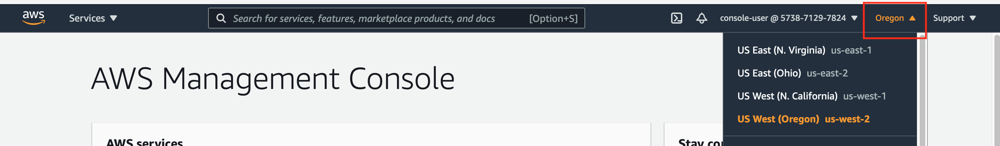

# Lab Environment Access

The labs for this class will require that you have access to the AWS Management Console and access to a provisioned lab workstation.

## AWS Management Console

The infrastructure created using Terraform in this class' labs will be created in an AWS account dedicated for your use.  Your instructor will provide the AWS account number and login credentials for you to access the AWS Management Console for the account.

In a browser, go to https://console.aws.amazon.com

If the login page shows options to log in as Root user or IAM user, select IAM user.  (If you don't see these options, don't worry.)

Enter the account number and login credentials.  From the console, you will have read access to view the infrastructure you subsequently provision in the labs using Terraform.

Be sure the "Oregon" region (us-west-2) is selected in the upper right of the console page.




## Workstation Virtual Machine

For the labs in this class you will using a virtual machine that has been provisioned for you in AWS.  You can choose between a Linux workstation or a Windows workstation.  Follow the instructions in the appropriate sub-section below.

### Linux Workstation for Labs

Your instructor will provide the following access information to you:
* Machine IP address or hostname
* SSH key

Save the SSH key in a temporary location on your local machine.  Use a terminal window or Putty to use SSH to access the remote workstation.

#### Terminal Window Access to Remote Linux Workstation

If your local machine is Linux-based or a Mac, you can use a terminal window to connect to the remote Linux machine.  Execute SSH from your local machine, substituting the appropriate values for <machine-ip> and <path-to-ssh-key> below. (If you get a message about authenticity of the host and asking if you want to continue, type 'yes'.)

```
ssh ubuntu@<machine-ip> -i <path-to-ssh-key>
```

After you connect, you will be in the home directory for the ubuntu user.  You can do the labs there (or you can create a separate folder if you want).

#### Putty Access to Remote Linux Workstation

If your local machine is Windows-based, you can use Putty to access the remote Linux machine.  If you are new to Putty, follow the instructions in the linked document below. **Use the host dns provided by your instructor in place of the host dns referenced in the document.**  (If the Default.ppk file does not work in your version of Putty, then you may need to use PuttyGen to convert the Default.pem file to a new Default.ppk file.)

https://cprime.securevdr.com/share/view/se9a65f4b06b64a578a6f0efd63d110bf

After you connect, you will be in the home directory for the ubuntu user.  You can do the labs there (or you can create a separate folder if you want).

### Windows Workstation for Labs

Your instructor will provide the following access information to you:
* Machine IP address or host dns
* User credentials (username and password)

Using Windows Remote Desktop from your local machine, enter the provided information to connect to the Windows machine.  If you are new to Windows Remote Desktop, follow the instructions in the linked document below.  **Use the host dns and credentials provided by your instructor in place of the host dns and credentials referenced in the document.**

https://cprime.securevdr.com/share/view/se9a65f4b06b64a578a6f0efd63d110bf

After you connect, open a command terminal window.  In the command window, you will be in the home directory for the user.  Although you could do the labs there, it would be cleaner to create a separate folder (or subdirectory) for the lab files.
