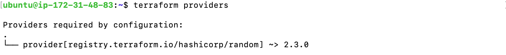

# Using a Provider

Lab Objective:
- Create an initial Terraform configuration by specifying a provider

## Preparation

Be sure to have completed the instructions on the "environment-access" page: [Verifying Environment Access](../environment-access/environment-access.md)

**NOTE:** All code for the labs in this class will be created and executed on the lab virtual machine.

## Lab

For this lab we will be using a provider called "random".

Create a file called `main.tf`:

```
touch main.tf
```

Open the file for edit.  You can use your choice of command line editor: vi, vim, nano.

In the file, create a terraform block to specify that "random" is a required provider.  We also specify that we want to use version 0.15.0 or above for the Terraform version.

```
terraform {
  required_providers {
    random = {
      source  = "hashicorp/random"
      version = "~> 2.3.0"
    }
  }
  required_version = "~> 0.15.0"
}
```

Add a provider block to configure the "random" provider. This provider does not require any special configuration.

```
provider "random" {
}
```

Save the file.

> For all the labs, the solution code for the lab is contained in the solution folder.  If you want to check your code or need some help, you can always look at or copy the solution code.

To see what you have done, run the following command:

```
terraform providers
```

You should see the following output showing that Terraform recognizes the provider you are wanting to use.


