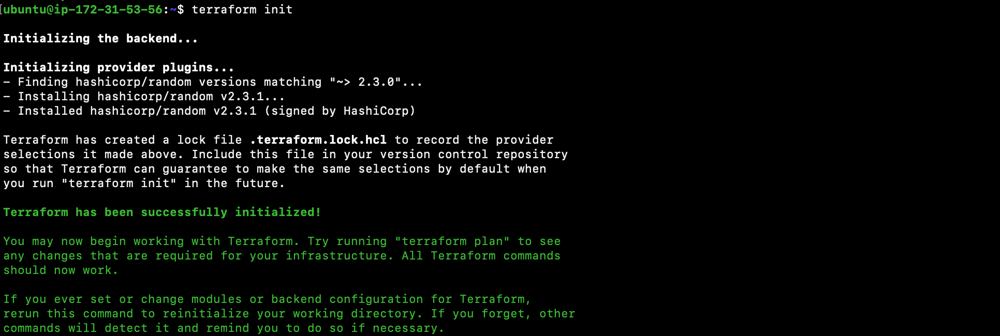
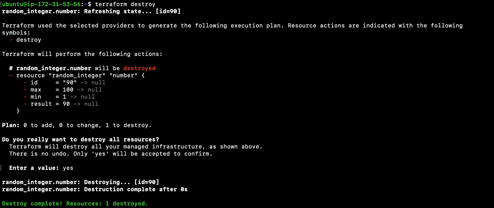

# Executing the Terraform Commands

Lab Objective:
- Use the Terraform init command to initialize a project
- Use the Terraform validate command to validate a configuration
- Use the Terraform plan command to create an execution plan
- Use the Terraform apply command to create a resource
- Use the Terraform destroy command to delete the resource

## Preparation

If you did not complete lab 2.1, you can simply copy the code from that lab as the starting point for this lab.

## Lab

Open the file `main.tf` for edit.

Add the following code to the end of the file to create a simple random number resource.

```
resource "random_integer" "number" {
  min     = 1
  max     = 100
}
```

Save the file.  (If you want to verify your code, you can compare your code to the main.tf file in the solution subfolder.)

Let's initialize the Terraform project. Run the following:

```
terraform init
```

You should see following:



Now let's validate the configuration. Run the following:

```
terraform validate
```

You should see following:


Let's generation an execution plan. Run the following:

```
terraform plan
```

The plan should only show creation since there was no prior state yet.  You should see output similar to the following:


Now let's actually apply the configuration. Run the following:

```
terraform apply
```
*You will be asked to confirm the apply command. Type 'yes'.*

You should see following:


Notice that there is now a file called terraform.tfstate.  Although you could open it, it is better to examine it using the terraform show command. Run the following:

```
terraform show
```

Notice that the contents show the generated random number as the "result" attribute.


To destroy the resource, run the following:

*You will be asked to confirm the destroy command. Type 'yes'.*

```
terraform destroy
```

You should see following:



Now run terraform show again to confirm that the current state shows no resources.

```
terraform show
```

The output from the command should be a blank line, which indicates the contents are empty.
