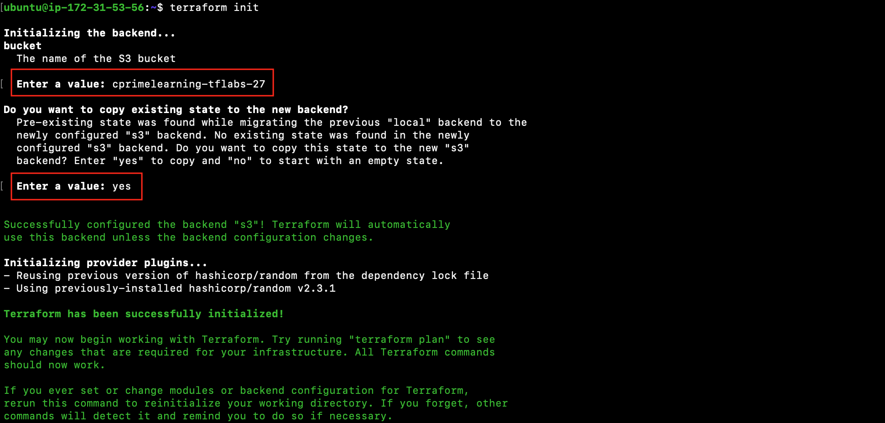

# Using AWS Backend

Lab Objective:
- Save Terraform state to backend in AWS S3

## Preparation

If you did not complete lab 2.2, you can simply copy the code from that lab as the starting point for this lab.

## Lab

Since we will want to show migration of state from local to remote, run terraform apply to ensure there is current state:

```
terraform apply
```

(If there was current state already, then the apply will show nothing to create; otherwise accept the changes to apply.)


### Authenticate to AWS

If you are running this lab from the virtual machine provisioned for you, permissions needed by Terraform have already been handled by an IAM role attached to the virtual machine. So there is nothing you need to do.

> If you are running this lab from a terminal shell somewhere else, then you would need to authenticate to AWS by one of the means discussed in class.

### Update Terraform configuration

We will be configuring a backend to store the terraform state in an AWS S3 bucket.  The bucket was already set up prior to the class.  The backend state will be stored in a new object created in the bucket.

Edit `main.tf` to add a backend for AWS.  Add the following as a sub-block in the terraform block.  *Make sure you are putting the new code inside the terraform block and not at the end of the file or another arbitrary location.*

```
  backend "s3" {
    region         = "us-west-2"
    key            = "terraform.labs.tfstate"
    dynamodb_table = "terraform-state-lock"
  }
```

Your resulting terraform block should look as follows:
```
terraform {
  required_providers {
    random = {
      source  = "hashicorp/random"
      version = "~> 2.3.0"
    }
  }
  backend "s3" {
    region         = "us-west-2"
    key            = "terraform.labs.tfstate"
    dynamodb_table = "terraform-state-lock"
  }
  required_version = "~> 0.15.0"
}
```

This will now direct the state to be saved in AWS.  Since you changed the backend configuration, you will need to run terraform init again.

A missing argument in the backend configuration above is the specification of the S3 bucket.  Terraform will therefore prompt you to enter the bucket name when you run terraform init.  The bucket name will be "cprimelearning-tflabs-NN" where NN is a student sequence number provided to you by the instructor.  For example, if your student identifier was "student-05" then your sequence number would be "05" and the bucket name would be "cprimelearning-tflabs-05".

Run:

```
terraform init
```

Terraform will prompt you for the bucket name. Type the name as per the instructions above.   

> If you enter the wrong bucket name, you will get an error.  Unfortunately you will not be able to just re-run terraform init.  You must first remove the `.terraform` subdirectory by typing `rm -rf .terraform`.  You can then re-run terraform init.

Terraform will then prompt you to migrate the existing state from the “terraform.tfstate” file to the new backend in AWS.

Type “yes”.



Terraform will copy the state to AWS.  The state will be saved in a new AWS S3 object referenced in the backend configuration above.

Notice that the `terraform.tfstate` file is left remaining in your working directory.  Although the file is now empty, you should delete the file to avoid confusion.

```
rm terraform.tfstate*
```

To confirm that the state still exists, use terraform show.

```
terraform show
```
