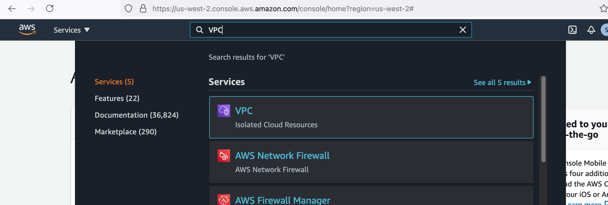
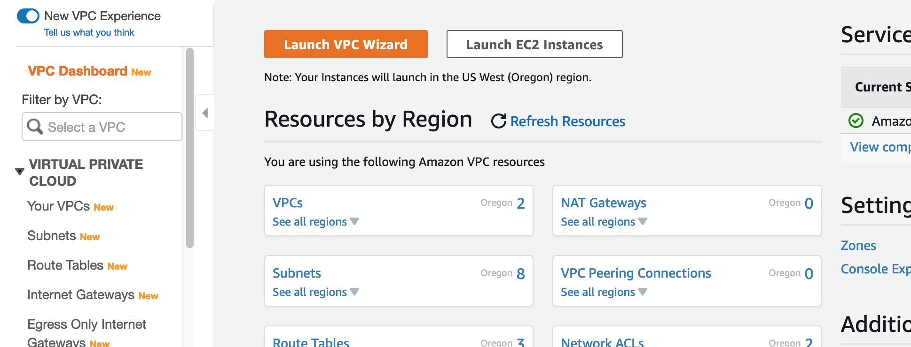
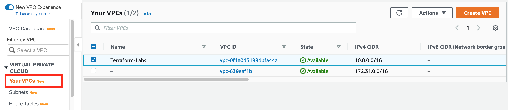
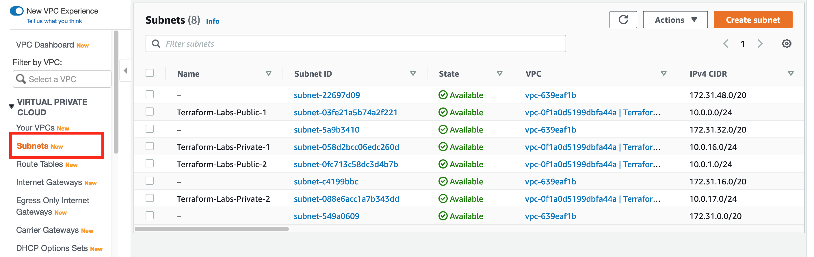

# Create a Network

Lab Objective:
- Create a simple network in AWS

## Lab

### Change to use AWS Provider

Open `main.tf` for edit and make the following changes:

1. Add AWS as a required provider.  We continue to use AWS for storing backend state.  The terraform block in main.tf should look as follows:

```
terraform {
  required_providers {
    random = {
      source  = "hashicorp/random"
      version = "~> 2.3.0"
    }
    aws = {
      source = "hashicorp/aws"
      version = "~> 3.0"
    }
  }
  backend "s3" {
    region         = "us-west-2"
    key            = "terraform.labs.tfstate"
    dynamodb_table = "terraform-state-lock"
  }
  required_version = "~> 0.15.0"
}
```

2. Add a provider block to configure the AWS provider.  The configuration specifies the AWS region into which we will create our infrastructure, as well as declares some common tags to associate to all created resources.

```
provider "aws" {
  region = "us-west-2"
  default_tags {
    tags = {
      Name = "Terraform-Labs"
      Environment = "Lab"
    }
  }
}
```

3. Delete the "random_number" resource from the file.  We no longer need that resource. (Keep the "random" provider since we will use it again later.)


### Define Network Resources

Create a new file `network.tf`.
```
touch network.tf
```

Either copy the contents of network.tf from the solution folder for the lab, or copy the code snippets in the following descriptions.

We will be defining a number of new resources in this file.  Let's walk through them.

1. A Virtual Private Cloud (VPC) for our network.

```
resource "aws_vpc" "lab" {
  cidr_block = "10.0.0.0/16"
}
```

2. An internet gateway to enable traffic to and from the public internet.  

```
resource "aws_internet_gateway" "lab" {
  vpc_id = aws_vpc.lab.id
}
```

3. Two public subnets.  Notice that the subnet CIDR blocks are within the VPC CIDR range.

```
resource "aws_subnet" "lab-public-1" {
  vpc_id                  = aws_vpc.lab.id
  cidr_block              = "10.0.0.0/24"
  availability_zone       = "us-west-2a"
  map_public_ip_on_launch = true
  tags = {
    Name = "Terraform-Labs-Public-1"
    SubnetTier = "Public"
  }
}

resource "aws_subnet" "lab-public-2" {
  vpc_id                  = aws_vpc.lab.id
  cidr_block              = "10.0.1.0/24"
  availability_zone       = "us-west-2b"
  map_public_ip_on_launch = true
  tags = {
    Name = "Terraform-Labs-Public-2"
    SubnetTier = "Public"
  }
}
```

4. A route table to direct outbound Internet traffic to the internet gateway.

```
resource "aws_route_table" "lab-public" {
  vpc_id = aws_vpc.lab.id
  route {
    cidr_block = "0.0.0.0/0"
    gateway_id = aws_internet_gateway.lab.id
  }
  tags = {
    Name = "Terraform-Labs-Public"
  }
}
```

5. An association of the route table to each of the public subnets.

```
resource "aws_route_table_association" "lab-public-1" {
  subnet_id      = aws_subnet.lab-public-1.id
  route_table_id = aws_route_table.lab-public.id
}

resource "aws_route_table_association" "lab-public-2" {
  subnet_id      = aws_subnet.lab-public-2.id
  route_table_id = aws_route_table.lab-public.id
}
```

6. Two private subnets.

```
resource "aws_subnet" "lab-private-1" {
  vpc_id            = aws_vpc.lab.id
  cidr_block        = "10.0.16.0/24"
  availability_zone = "us-west-2a"
  tags = {
    Name = "Terraform-Labs-Private-1"
    SubnetTier = "Application"
  }
}

resource "aws_subnet" "lab-private-2" {
  vpc_id            = aws_vpc.lab.id
  cidr_block        = "10.0.17.0/24"
  availability_zone = "us-west-2b"
  tags = {
    Name = "Terraform-Labs-Private-2"
    SubnetTier = "Application"
  }
}
```

Stop to think a minute about the infrastructure we have defined. Does it make sense?

Run terraform init.  Do you know why we need to re-run this command?
```
terraform init
```
Run terraform validate.
```
terraform validate
```
Run terraform plan.  Look though the plan to confirm it matches what you would expect.
```
terraform plan
```
If you see in the plan that random_integer.number is to be destroyed, that is okay.  Do you know why this is happening?

Run terraform apply to create all the new infrastructure. *Be sure to type 'yes' to perform the actions.*
```
terraform apply
```

### Viewing Results in the AWS Management Console

Let's use the AWS Console to see what you just created.  Go to the browser in which you logged into the Console UI.

In the search bar at the top of the AWS Console page, type "VPC".  Select the VPC service from the drop-down.


<br /><br />

On the VPC dashboard page, select the "Your VPCs" menu item in the left navigation panel.


<br /><br />

You will see two VPCs listed.  One has the name "Terraform Labs".  This is the one you just created.  You can ignore the other VPC.


<br /><br />

Click on the "Subnets" menu item in the left navigation panel.  You will see a listing of the subnets that were created.  Note that the subnets with names beginning with "Terraform Labs" were created in the Terraform Labs VPC.  Confirm that the CIDR blocks of the subnets are as expected.


