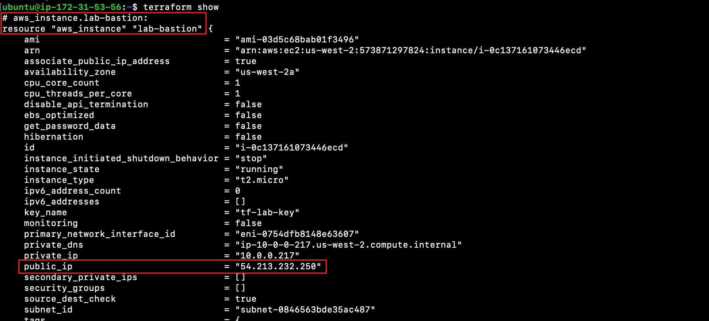

# Virtual Machine

Lab Objectives:
- Create a virtual machine with a public IP
- See the effect of making a change to an existing resource

## Preparation

If you did not complete lab 3.1, you can simply copy the solution code from that lab (and run terraform apply) as the starting point for this lab.

## Lab

### Creating a Virtual Machine

The virtual machine we create in this lab is for a bastion host that has access from the public Internet.

Create a new file “bastion.tf”.

Add two new resources to this file.

1. A security group to enable SSH access to the bastion host.
```
resource "aws_security_group" "lab-bastion" {
  name    = "terraform-labs-bastion"
  vpc_id  = aws_vpc.lab.id

  ingress {
    description = "SSH Access"
    from_port   = 22
    to_port     = 22
    protocol    = "tcp"
    cidr_blocks = ["0.0.0.0/0"]
  }

  egress {
    from_port   = 0
    to_port     = 0
    protocol    = "-1"
    cidr_blocks = ["0.0.0.0/0"]
  }

  tags = {
    Name = "Terraform-Labs-Bastion"
  }
}
```

2. A virtual machine. (The SSH key for accessing the VM already exists and will be provided to you by the instructor.)
```
resource "aws_instance" "lab-bastion" {
  ami                    = "ami-03d5c68bab01f3496" # ubuntu OS
  instance_type          = "t2.micro"
  subnet_id              = aws_subnet.lab-public-1.id
  vpc_security_group_ids = [aws_security_group.lab-bastion.id]
  key_name               = "tf-lab-key"

  tags = {
    Name = "Terraform-Labs-Bastion"
  }
}
```

Run terraform validate to make sure you have no errors:
```
terraform validate
```

Run terraform plan.  See that two new resources will be created.
```
terraform plan
```

Run terraform apply:
```
terraform apply
```


### Try connecting to the virtual machine

Let's try checking that the infrastructure actually works by connecting to the virtual machine.

To connect to the virtual machine, you need its public IP.  You can get this in a couple ways:

1. Run terraform show

    a. Scroll up in the output to find the state for the virtual machine.  One of its attributes should be public_ip.

    

2. Go to the AWS Console

    a. In the portal search bar, type EC2.  Select the EC2 auto-suggestion in the drop-down.  

    b. On the EC2 dashboard, click the "Instances" menu option.  

    c. In the instance, scroll to the right to see the Public IPv4 address.

    

<br /><br />
Once you find the public IP, SSH to the machine.  In the terminal console, type (substituting in the correct public IP):

```
ssh ubuntu@<public-ip> -i tf-lab-key.pem
```
*You may also be prompted to confirm that you want to connect. Enter "yes".*

Confirm you can ssh into the machine.


Exit the SSH session on the virtual machine.

### Making Changes to An Existing Resource

Let's suppose your organization also wants to support accessing the bastion host via a VPN.  To enable this access, we will modify the security group to allow TCP traffic on port 1194.

Add the following to the security group in the bastion.tf file.  To see where to add the code, go to the Terraform documentation page for "aws_security_group". (Or you can look at the code in the solution folder of this lab.)

```
  ingress {
    description = "VPN Access"
    from_port   = 1194
    to_port     = 1194
    protocol    = "tcp"
    cidr_blocks = ["172.31.23.0/24"]
  }
```

Save the file and run terraform plan:
```
terraform plan
```

Notice that the plan shows an update to the security group.


Run terraform apply (remember to confirm yes to the changes):
```
terraform apply
```
