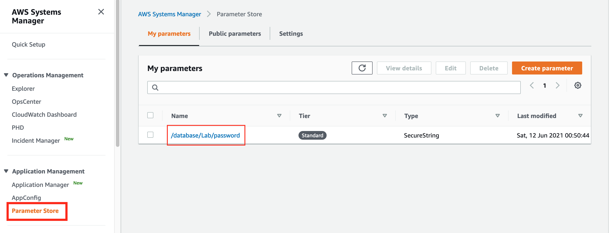
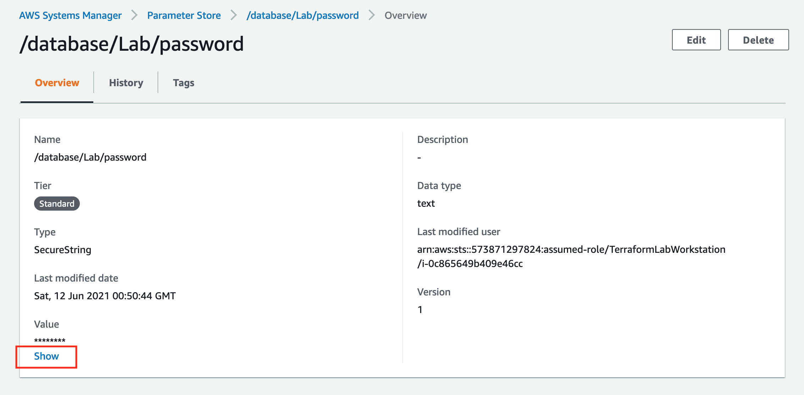

# Secure Password

Lab Objective:
- Create a random password and store it in AWS parameter store
- Update database resource to use secured password

## Preparation

If you did not complete lab 3.3, you can simply copy the solution code from that lab (and do terraform apply) as the starting point for this lab.

## Lab

Open the file `database.tf` for edit.

Add a new resource to create a random password that satisfies the constraints for MySQL passwords.
```
resource "random_password" "dbpassword" {
  length           = 12
  min_numeric      = 1
  special          = true
  override_special = "_%#*!"
}
```

Securely store the new password in AWS Parameter Store.
```
resource "aws_ssm_parameter" "dbpassword" {
  name  = "/database/Lab/password"
  type  = "SecureString"
  value = random_password.dbpassword.result
  tags = {
    Name = "Terraform-Labs-Database"
  }
}
```

Now, update the database resource to use the new secure password instead of a hard-coded password.  In the existing "aws_db_instance" resource, change the "password" argument:
```
  password             = aws_ssm_parameter.dbpassword.value

```

Run terraform validate to make sure you have no errors:
```
terraform validate
```

Run terraform plan.  Two new resources will be created, and the database will be updated in-place.
```
terraform plan
```

Run terraform apply.
```
terraform apply
```

Let's now see that Terraform treats a random password resource as a sensitive value.

First, look back at the output from the terraform plan and apply operations.  You will see that the password value in all the resources is shown as "(sensitive value)".

Next, run the following to verify that the value is also displayed as “(sensitive value)” when displaying the terraform state.  This ensures that the secure password does not leak into logs.

```
terraform state show aws_ssm_parameter.dbpassword
terraform state show random_password.dbpassword
```


:bangbang: NOTE: Using credentials stored in parameter store helps secure the database.  Applications that need to access the database should use provisioning logic to extract the password from the parameter store and inject it into the application.  The password should not be saved in files on an application server.

### Viewing the Password in AWS Console

For privileged users, the password can be revealed through the AWS console.  Let's take a look.

1. In the AWS console search bar, type "systems manager". Click on the Systems Manager item in the drop-down.

2. On the Systems Manage dashboard page, click on the "Parameter Store" menu item in the left navigation panel.  This will show a list of your stored parameters.



3. In the list of parameters, click on the parameter "/database/Lab/password".  On the parameter overview page, you can click on "Show" to see the password.


