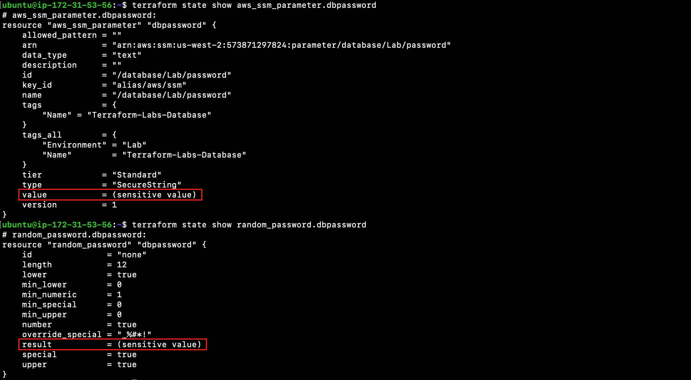

# Secure Password

Lab Objective:
- Create a random password and store it in AWS parameter store
- Update database resource to use secured password

## Preparation

If you did not complete lab 3.3, you can simply copy the solution code from that lab (and do terraform apply) as the starting point for this lab.

## Lab

Open the file "database.tf" for edit.

Add a new resource to create a random password that satisfies the constraints for MySQL passwords.
```
resource "random_password" "dbpassword" {
  length           = 12
  min_numeric      = 1
  special          = true
  override_special = "_%#*!"
}
```

Securely store the new password in AWS Parameter Store.
```
resource "aws_ssm_parameter" "dbpassword" {
  name  = "/database/Lab/password"
  type  = "SecureString"
  value = random_password.dbpassword.result
  tags = {
    Name = "Terraform-Labs-Database"
  }
}
```

Now, update the database resource to use the new secure password instead of a hard-coded password.  In the existing "aws_db_instance" resource, change the "password" argument:
```
  password             = aws_ssm_parameter.dbpassword.value

```

Run terraform validate to make sure you have no errors:
```
terraform validate
```

Run terraform plan:
```
terraform plan
```

Run terraform apply.
```
terraform apply
```


Let's now see that Terraform treats a random password resource as a sensitive value. Run the following to verify that the value is not actually shown and is displayed as “(sensitive value)”.  This ensures that the secure password does not leak into logs.

```
terraform state show aws_ssm_parameter.dbpassword
terraform state show random_password.dbpassword
```



### Viewing Results in Azure Portal

Let’s now confirm the secret was created in Azure.

Go to the Azure Portal.  Type “vault” and select the “Key vaults” auto-suggestion.


Click on the key vault.


Click on Secrets to confirm your database password secret was created.


:bangbang: NOTE: Using credentials stored in parameter store helps secure the database.  Applications that need to access the database should use provisioning logic to extract the password from the parameter store and inject it into the application.  Although the password in the parameter store can be revealed to privileged users, the password should not be saved in files on an application server.
