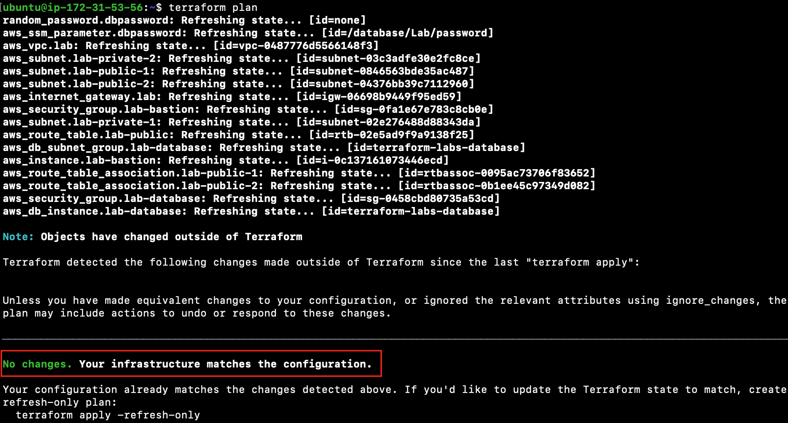

# Using Locals

Lab Objective:
- Use locals to set common or potentially changeable values

## Preparation

If you did not complete lab 3.4, you can simply copy the solution code from that lab (and run terraform apply) as the starting point for this lab.

## Lab

Look through the code to see what literal values might be best declared in a common block rather than sprinkled throughout the code.  What do you come up with?

Open the file “main.tf”.

In your main.tf file open for edit, add a locals block at the bottom of the file:
```
locals {
  region       = "us-west-2"
  environment  = "Lab"
  instance_ami = "ami-03d5c68bab01f3496"
}
```

Use the locals to replace the literal values in various resources:
* Replace the region attribute value in the aws provider block in "main.tf" with <code>local.region</code>
* Replace the value of the Environment tag in the aws provider block in "main.tf" with <code>local.environment</code>
* Replace the ami attribute value in the "aws_instance" resource in "bastion.tf" with <code>local.instance_ami</code>
* Replace the name attribute value in the "aws_ssm_parameter" resource in "database.tf" with <code>"/database/${local.environment}/password"</code>

Compare your changes to the code in the solution folder.

Run terraform validate to confirm your edits are okay.  
```
terraform validate
```

Run terraform plan:
```
terraform plan
```

Confirm that the plan does not come up with any changes to make to the actual infrastructure in AWS.

