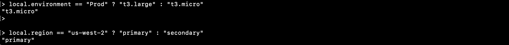
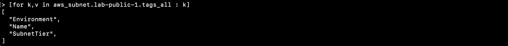

# Expressions

Lab Objectives:
- Construct various types of expressions
- Use "terraform console" as development tool

## Lab

In this lab we will be using the “terraform console” command.  This opens the command line into a mode that allows you to type in expressions that are then evaluated.

Open Terraform console on the command line:

```
terraform console
```

At the “>” prompt, enter the following to see what they evaluate to.

#### Literal Values:

```
> 6.3

> ["foo", "bar", "baz"]

> true
```

<details>

 _<summary>Click to see results of above</summary>_


</details>

:information_source: Be careful when typing the quotes in the 2nd example above. Also, note that "True" will return an error in the 3rd example.

#### Conditional:

```
> local.environment == "prod" ? "t3.large" : "t3.micro"

> local.region == "us-west-2" ? "primary" : "secondary"
```
<details>

 _<summary>Click to see results of above</summary>_


</details>

#### Splat Expression:

```
> aws_security_group.lab-bastion.ingress[*].to_port
```

<details>

 _<summary>Click to see results of above</summary>_


</details>

#### for expression:

_Extract the keys of the subnet tags:_

```
> [for k,v in aws_subnet.lab-public-1.tags_all : k]
```

<details>

 _<summary>Click to see results of above</summary>_


</details>

<br /><br />
To exit the Terraform console, type:

```
> exit
```
