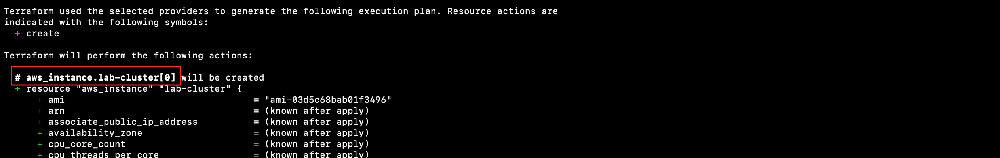

# Multiplicity

Lab Objective:
- Use for_each for multiple S3 buckets
- Use count for multiple VMs in an availability set

## Preparation

If you did not complete lab 4.4, you can simply copy the solution code from that lab (and do terraform apply) as the starting point for this lab.

## Lab

### Using for_each

Create a new file "s3.tf", and open it for edit.

We are going to create a few S3 buckets, where the buckets differ not only by the bucket name but also by a couple of other properties.

The for_each operation requires a map to define the different values for each resource instance.  Add the following map to the "s3.tf" file to specify three buckets and two properties for each bucket.
```
locals {
  application_buckets = {
    uploads = {
      acl        = "private"
      versioning = true
    },
    media = {
      acl        = "private"
      versioning = false
    },
    feeds = {
      acl        = "public-read"
      versioning = true
    }
  }
}
```

We can now add a resource declaration to create the S3 buckets.  Look at the code below to see how we use the map key and values in the resource.
```
resource "aws_s3_bucket" "lab-bucket" {
  for_each = local.application_buckets

  bucket_prefix = "terraform-labs-${each.key}-"
  acl           = each.value.acl

  versioning {
    enabled = each.value.versioning
  }
}
```

Run terraform validate:
```
terraform validate
```

Run terraform plan.  You should get a plan that will create three buckets.
```
terraform plan
```


Run terraform apply.
```
terraform apply
```


### Using count

To show the use of count, we will create a small cluster of virtual machines behind a load balancer.

Create a new file called “lb.tf”

Copy the contents from the lb.tf file in the solution directory into your new file.  Notice that it declares three new resoureces:

* A security group to enable HTTP traffic through the load balancer
* A load balancer
* A target group to forward HTTP traffic to the cluster virtual machines

Do not make any changes.  You can examine the file, but leave it as is.  We will be coming back to revisit this file in a subsequent lab.

Open outputs.tf

Add a new output so we can easily get the load balancer DNS name:
```
output "load-balancer-dns" {
  value = aws_lb.lab.dns_name
}
```

Create a new file called “vm-cluster.tf” and open it for edit.

Add a locals block to create a list of the ids of the private subnets.
```
locals {
  private_subnet_ids = [aws_subnet.lab-private-1.id, aws_subnet.lab-private-2.id]
}
```
> Extra Credit: Can you find a data source we could use in place of the local -- i.e., a data source that would read the subnet ids for subnets with the tag SubnetTier = "Application"?

Next, we will create three resources.  Notice that we will be using the count meta-argument in two of the resources to create multiple instances of the resources.  The count will be based on a new local (which we will add later) to set the size of the VM cluster.

1. Add a security group to enable SSH access from the bastion host and HTTP traffic from the load balancer.
```
resource "aws_security_group" "lab-cluster" {
  name    = "terraform-labs-cluster"
  vpc_id  = aws_vpc.lab.id

  ingress {
    description = "SSH Access"
    from_port   = 22
    to_port     = 22
    protocol    = "tcp"
    cidr_blocks = ["${aws_instance.lab-bastion.private_ip}/32"]
  }
  ingress {
    description = "HTTP Access"
    from_port   = 80
    to_port     = 80
    protocol    = "tcp"
    security_groups = [aws_security_group.lab-alb.id]
  }

  egress {
    from_port   = 0
    to_port     = 0
    protocol    = "-1"
    cidr_blocks = ["0.0.0.0/0"]
  }

  tags = {
    Name = "Terraform-Labs-Cluster"
  }
}
```

2. Add the virtual machines.  We use count here to create multiple virtual machines.  Note that the VMs are identical other than references to count.index.
```
resource "aws_instance" "lab-cluster" {
  count = local.cluster_size

  ami           = local.instance_ami
  instance_type = "t3.micro"
  subnet_id     = local.private_subnet_ids[count.index % length(local.private_subnet_ids)]

  vpc_security_group_ids = [aws_security_group.lab-cluster.id]
  key_name               = var.vm_keypair_name

  tags = {
    Name = "Terraform-Labs-Cluster-VM-${count.index}"
  }
}
```

3. Attach the virtual machines to the target group of the load balancer.  We use count to create a separate attachment for each virtual machine.
```
resource "aws_lb_target_group_attachment" "lab-cluster" {
  count = local.cluster_size

  target_group_arn = aws_lb_target_group.lab.arn
  target_id        = aws_instance.lab-cluster[count.index].id
  port             = 80
}
```

Open main.tf for edit.

In the locals block, add a new local value for cluster_size.  Set it to 2.
```
  cluster_size = 2
```

Okay, that's a lot of edits.  Be sure to run terraform validate to make sure you got everything.
```
terraform validate
```

Run terraform plan to verify what will be created.  Scroll through the plan.  Does it match what you would expect?  Notice how the plan uses an array index to reference the multiple instances of the new virtual machine resources.
```
terraform plan
```



Run terraform apply:
```
terraform apply
```

> *(Optional) Trying out the load balancer*: If you have extra time now or later, you can verify that the load balancer actually works to connect to the clustered VMs.  See the instructions at [Testing Your Cluster](../optional-material/testing_your_cluster.md).

### Using count for conditional creation

Open the file "main.tf" for edit.  In the locals block, add a local to control whether or not we allow archiving.
```
  archiving_enabled = false
```

Open the file "s3.tf" again for edit.

Add a resource for another S3 bucket, but with a conditional expression for count.  Note that the count could evaluate to either 0 or 1 depending on the value of local.archiving_enabled.
```
resource "aws_s3_bucket" "archive" {
  count = local.archiving_enabled ? 1 : 0

  bucket_prefix = "terraform-labs-archives-"
  acl           = "private"
}
```

### (Optional) Trying out the load balanced cluster

If you have extra time now or later, you can verify that the load balancer actually works to connect to the clustered VMs.  See the instructions at [Testing Your Cluster](../optional-material/testing_your_cluster.md).
