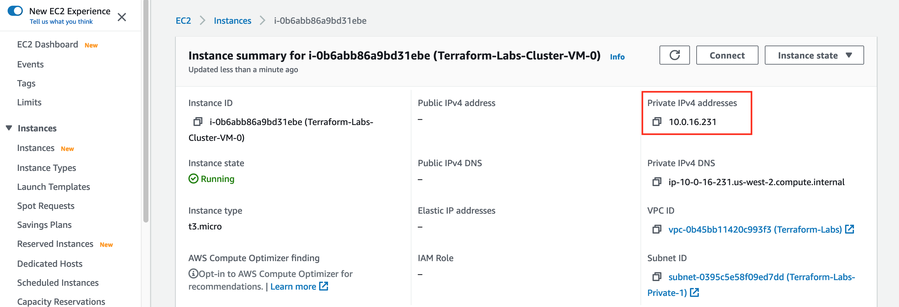
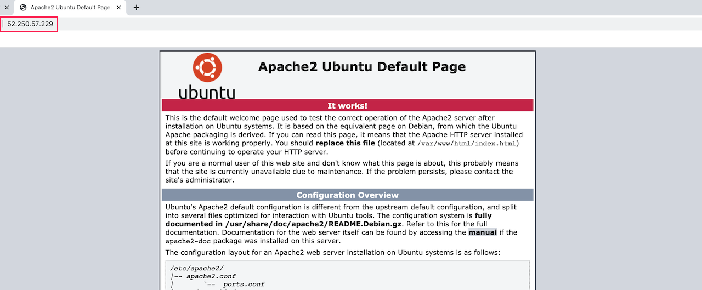

# Verifying Your Load-Balanced Cluster

If you want to verify that the load-balanced cluster actually works, you can follow the instructions below to install an HTTP server on the cluster VMs and then use the load balancer public DNS in a browser to make an HTTP request.

### Log into Bastion Host

The cluster VMs are in a private subnet and can only be accessed indirectly via the bastion host.

From doing the labs, the public IP of the bastion host should be an output `bastion-public-ip`.  You can SSH to to the bastion host as follows (substituting the correct public IP):
```
ssh ubuntu@<bastion-public-ip>
```

*You may also be prompted to confirm that you want to connect. Enter "yes".*


### Connect to Cluster VMs and Install HTTP Server

From the bastion host, you can SSH to each of the cluster VMs. To SSH to the cluster VMs, you will need their private IPs since these machines do not have a public IP.  You can find those by viewing the cluster VMs in the AWS Management Console, or by using terraform show to see the state of the resources.



From the bastion host, ssh using the private IP of the new VMs.
```
ssh ubuntu@<vm-private-ip>
```

On each of the cluster VMs, run the following command to start a simple HTTP server on each VM.
```
sudo apt-get install -y apache2
```


Exit from the cluster VM and bastion host.


### Invoke HTTP Request from Browser

Get the DNS of the load balancer.  It is one of the outputs in your Terraform state.
```
terraform output load-balancer-dns
```

You can now go to a browser and use the DNS of the load balancer to hit the HTTP server on the VMs.  


